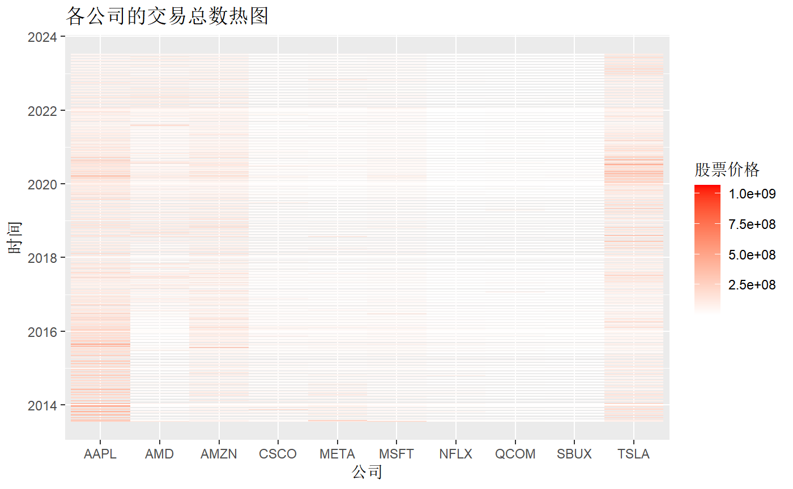

# 时序模型

本题提供的数据集共包含25161行，每行代表特定公司在给定日期的股市数据。数据是从www.nasdaq.com通过网络抓取收集的信息包括上市公司的股价和交易量，如苹果、星巴克、微软、思科系统、高通、Meta、亚马逊、特斯拉、Advanced Micro Devices和Netflix。请对这些公司的数据进行统计分析，希望您能够为投资者提出可靠并宝贵的建议。

## 数据分析

### 源数据分析

1. **Company**: 公司的股票符号，用来在股票市场上唯一识别它。例如，“AAPL”代表苹果公司。

2. **Date**: 记录股票市场数据的日期，它表示与股票数据相关的交易日。

3. **Close/Last**: 公司股票在给定日期的收盘价或最后一次交易价格，它代表了当天股票交易的最终价格。

4. **Volume**: 公司股票在给定日期交易的股票总数，它表示当天投资者对该股票的兴趣和流动性水平。

5. **Open**: 公司股票在指定日期的开盘价格，它是第一次交易在交易时段发生的价格。
6. **High**: 公司股票在给定日期内交易的最高价格，它表示在交易时段达到的最高价格。

7. **Low**: 该公司股票在给定日期内交易的最低价格，它表示在交易时段所达到的最低价格。

数据集中的10家公司股票所属板块可初步分为：

1. **科技公司**：苹果（Apple）、微软（Microsoft）、思科系统（Cisco Systems）、高通（Qualcomm）、Meta（前称Facebook）

2. **消费品/服务公司**：星巴克（Starbucks）、亚马逊（Amazon）

3. **汽车/新能源公司**：特斯拉（Tesla）

4. **半导体公司**：Advanced Micro Devices（AMD）

5. **娱乐/媒体公司**：Netflix

### 公司股票趋势分析

收盘价是最常用的股票价格指标之一，可以用来展示股票价格的整体走势和日内波动。为了分析各公司股票价格随时间的分布，选用收盘价（Close.Last）与时间日期（Date）创建可视化折线图。

绘制视图前，对公司进行板块分类，得出五大类Car/Media/SC/Serv/Tech，便于分类观察。

由上方折线图可以得到以下整体分析：

- 2014-2018年，10家公司都没有太明显的波动，处于平稳阶段。
- 2018-2022年，META、MSFT、NFLX和TSLA公司有显著的波动上升趋势，且AAPL、AMD、AMZN、QCOM有略微上升趋势。可以看出这段时间股价涨势向好，这可能是由于这些公司的业绩表现出色，市场前景好，以及整个市场的涨势等因素影响。
- 2022-2023年，由于疫情影响，全球市场产生波动，股价出现了急剧下跌，尤其META、NFLX、TSLA最为明显。但是在2023年下半年全球经济逐步恢复和市场需求增加的背景下，这些公司的股价开始有所回升。

所以在不同大环境、时间节点下，多只股票拥有着较为一致的走势和趋势，但波动幅度有较大差异。受市场、公司绩效等影响，有的股票整体较为平稳，而有的股票上下波动较大。NFLX由于波动最大，曾达到其他公司未曾达到的峰值。

由上方折线图可以得到以下分类分析：

- **汽车板块**

  2020到2022年，该板块股市处于上升阶段。此时由于政府的支持与推广以及环保意识的不断增强，新能源概念火爆，新能源汽车的市场需求和销售量都在不断攀升。其中代表性公司特斯拉 (TSLA) 推出了许多引领行业发展的高科技产品，导致股价上升；

  到2022年，TSLA股价下跌，包括事故频发、竞争加剧、供应链瓶颈、疫情后全球股市下跌等不利因素。

  在2023股价回升，全球电车需求增长以及自动驾驶技术领先。

- **媒体娱乐板块**

  在2020到2022年期间，NFLX股价上涨迅速，主要是因为疫情推动线上娱乐服务的需求增长，Netflix不断推出高质量的原创内容，通过价格策略的调整、全球扩张等措施增强了自己的竞争力，加上总体市场环境的好转和科技股热情高涨等因素的综合作用。

  2022上半年，疫情好转影响了线上娱乐需求，NFLX股价迅速下跌，同时公司面临着越来越严峻的竞争压力和高昂的内容制作成本。

  2022下半年到2023年，股价回升，得益于成功的内容制作和分发、全球经济复苏、市场份额扩大。

- **半导体板块**

  2022年前，由于供应链恢复、数字化加速、5G和云计算需求增加，以AMD为代表的半导体行业股价稳步上升。

  2022年，全球股市调整，竞争压力、业绩预期和供应链等问题成为AMD股价略微下降的原因。

  2023年，全球经济复苏，市场需求增长，AMD股价缓慢回升。

- **服务类板块**

  2020-2022年全球疫情间，服务类股价略有上升，但较为平缓。尤其是线上购物平台亚马逊（AMZN）得益于疫情配送服务。

  2022-2023年，由于疫情好转，人们的活动减少了对线上购物的依赖，股价有所下降，但仍然总体平稳。

- **科技板块**

  2020-2022年前由于疫情影响，线上办公需求激增，各大科技公司负责的软件产品需求增加，导致整个板块股价上升。

  2022年由于同样的疫情原因与市场调整，股价下降。2023年经济复苏，股价得以回升。

总体看来，各板块以及公司的股价受时间（疫情）影响较大，且同板块的变化具有一致性、股价的整体形势也具有全球性。

### 公司股票季节性分析

为探究股票的交易价格、最高价、最低价、交易总数与季节（季度）的关系，分别对每个公司的数据进行了可视化处理。其中Quarter为新建属性，由Date中表示月份的数据计算得来。

1. **各公司各季度平均股票价格条形图**

   计算每个公司各个季度股票收盘价的平均值，并绘制条形图。由图可以发现平均股票价格随季节具有轻微波动趋势，但由于波动较为平缓，股价与季节是否相关仍需进一步观测。

2.**股票价格/交易总数热图**

热图是一种用颜色编码数据值的可视化方法，能够强调模式、快速发现规律。我们通过热图对各公司股票价格、交易总数与时间的关系分别进行了绘制。

由上图可知，各公司的股票价格在2020-2022年呈现热值，表明这段时间价格较高，且呈现上升趋势。获得股价最高值的公司为NFLX。

通过交易数量热图可以看出哪只股票在合适最受欢迎。由上图横向来看，AAPL与TSLA较其他几只股票较为火爆，一直获得众多关注，交易总数呈现热值。随后为AMZN与AMD。从纵向来看，2018年前，AAPL公司的总交易量在逐渐下降，而TSLA在2020年呈现最热值，此时最受欢迎。

### 相关性分析

为调查不同公司收盘价之间的相关性以确定潜在的关系，我们计算了相关系数，生成相关系数矩阵。

由于数据繁复，因此绘制出如下相关矩阵热图。可以看出所有公司的股票都具有正相关性，并且部分公司间的股票相关性较强。

- 对于**AAPL**来说，它与**AMD、MSFT、QCOM**和**TSLA**之间呈现较强的相关性。这可能意味着AAPL受到半导体行业、科技行业和汽车行业的影响较大。这些公司之间的收盘价变动可能会互相影响，可能存在一些共同的宏观经济或行业因素。

- 对于**AMD**来说，它与**MSFT、QCOM**和**TSLA**之间表现出较强的相关性。这暗示AMD与科技行业和汽车行业之间可能存在某种关联关系。这种相关性可以进一步探究，例如AMD是否供应给这些公司的半导体产品，或者它们是否面临相似的市场趋势和竞争环境。
- 对于**AMZN**来说，它与**META、NFLX**之间表现出较强的相关性。META虽然属于科技板块，但其发布的产品为社交娱乐平台，与NFLX可以一同视作媒体娱乐版块，他们的受众群体很大的重叠，因此这些公司间的股票价格相关性较大。

除了以上提到的公司对，其他公司之间的相关性较弱，这意味着它们可能受到不同的市场因素和行业动态影响，或者它们之间的联系较弱。

### 波动性分析

为可视化各公司股票的波动性，提取各公司的闭盘价格计算标准差以示波动性，绘制出如下柱状图与箱线图。

根据绘制出的股票波动性柱状图和箱线图可以看到，不同公司的股票波动性存在较大的差异。以标准差作为波动性的指标来看，NFLX公司波动性最大，CSCO公司波动性最小，而其他公司的波动性介于这两个极端之间，处于中等的分布范围。箱线图显示META和TSLA两家公司的收盘价存在离群值，出现了异常波动。

### 最佳潜力股
根据资料搜索与分析，潜力股有如下特征：

+ 启动价位低：股价数值较小。
+ 业绩改善非常明显：波动性较大，且呈上升趋势（有正涨幅）。
+ 公司故事：通过交易总热度的变化程度体现。

因此确定将**波动性**、**涨幅**、**交易总热度**作为最佳潜力股的指标。

我们将涨幅定义为
<math xmlns="http://www.w3.org/1998/Math/MathML" display="block"><mi>C</mi><mi>h</mi><mi>a</mi><mi>n</mi><mi>g</mi><mi>e</mi><mo>=</mo><mfrac><mrow><mi>C</mi><mi>l</mi><mi>o</mi><mi>s</mi><mi>e</mi><mo>.</mo><mi>L</mi><mi>a</mi><mi>s</mi><mi>t</mi><mo>−</mo><mi>O</mi><mi>p</mi><mi>e</mi><mi>n</mi></mrow><mrow><mi>O</mi><mi>p</mi><mi>e</mi><mi>n</mi></mrow></mfrac><mo>×</mo><mn><mi>10000</mn></math>
据此绘制了涨幅的箱线图，其中每个点表示一家公司，横坐标代表公司名称，纵坐标代表涨幅。

得到一个有趣的发现，涨幅中位数都在0附近（即使调整涨幅的比率大小），且上四分位数与下四分位数没有很大的差距，基本对称，类似正态分布。

根据公司分别绘制涨幅数据的密度图，如下所示，肉眼看确实成正态分布：

观察离群值的分布，AMD有最大正涨幅、QCOM为其次；NFLX有最大负涨幅（跌幅），但其余都集中分布在-1000以内。

通过涨幅与波动性观测，NFLX，AMD，TSLA具有较好的业绩改善。
通过交易总热度变化观测，AAPL，TSLA具有丰富的公司故事。
通过股价数值折线图与热图观测，除MSFT，NFLX，其余都有较低的启动价位（当前时间），而QCOM目前在下跌，未来也具有上拉潜力。

综上，在政策、市场等没有较大的波动情况下，推荐TSLA为最佳潜力股。
